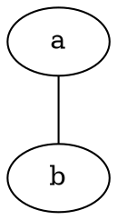

# graphviz

<rat graph />

---

render graphviz dot graphs directly in the web-app. graphviz graph is described
by a codeblock with `graphviz` language. like ( with ... instead of ```)

```
...graphviz
...
```


